# Movie Without Conflict

Movie Without Conflict es una aplicación web , con accesibilidad vía web y mobile, tiene como finalidad
facilitar la elección de películas ya sea para ver sóla(o) o en grupo.

## Proyecto desarrollado en [Laboratoria](http://laboratoria.la) 

## En  [Peru](http://peru.com)

HACKATON: "Movies"
==================
## SQUAD:
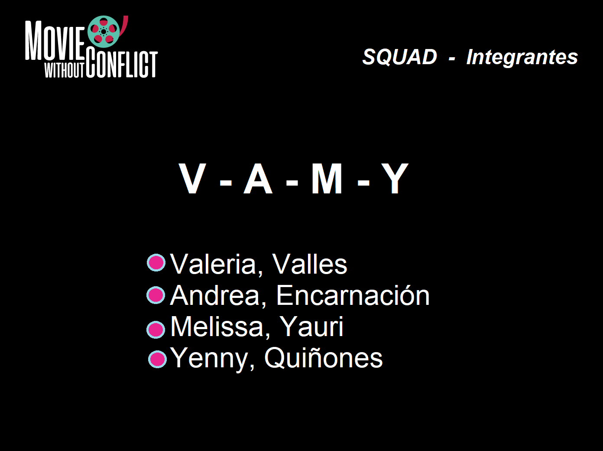

## INTEGRANTES:  
- Encarnación Gomez, Andrea - andrea_206_93@hotmail.com
- Quiñones Jauregui, Yenny Elizabeth - yenny.quinones.jauregui@gmail.com
- Valles , Valeria - sindryv@gmail.com
- Yauri Machaca , Melissa Rossmery - yaurimelissa@gmail.com

## PROBLEMA
- Problema o Requerimiento: Ausencia de un Aplicativo que guíe la elección de películas a ver
para una persona que quiere ver sola(o) ó acompañada(o).

## SOLUCIÓN : Movie Whithout Conflict

### LOGO
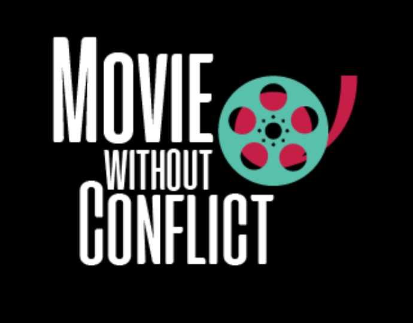

### FAST VIEW
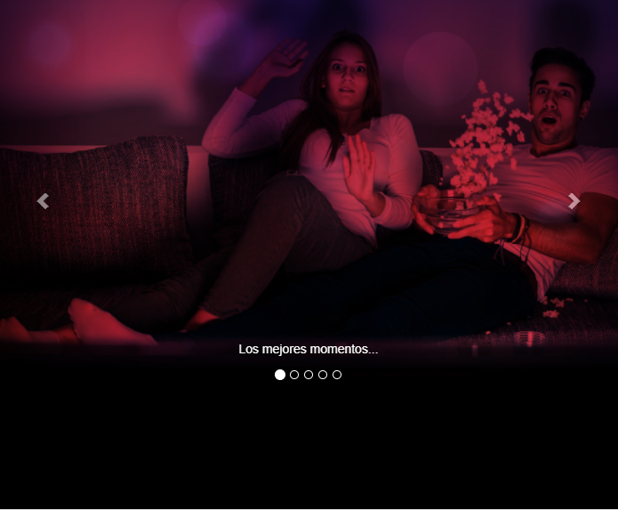

## BREVE EXPLICACION:
- Movie Without Conflict , es una aplicación web , con accesibilidad vía web y mobile, tiene como finalidad
facilitar la elección de películas ya sea para ver sóla(o) o en grupo.

## PROTOTIPO :
### GLOBAL VIEW
----------------------
#### INICIO Y PRESENTACIÓN
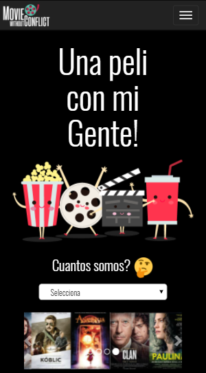

#### FLUJO VER PELÍCULA SÓLO
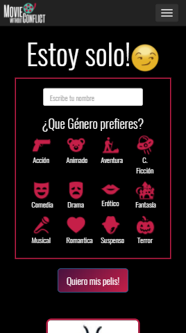

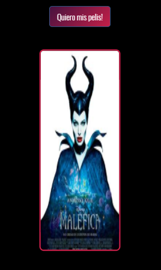

#### FLUJO VER PELÍCULA EN GRUPO

## VERSIONES
- Vs-MWC-01 Actual versión.

## ANEXOS
- Modelo Cuestionario de Entrevista Online
  
  
  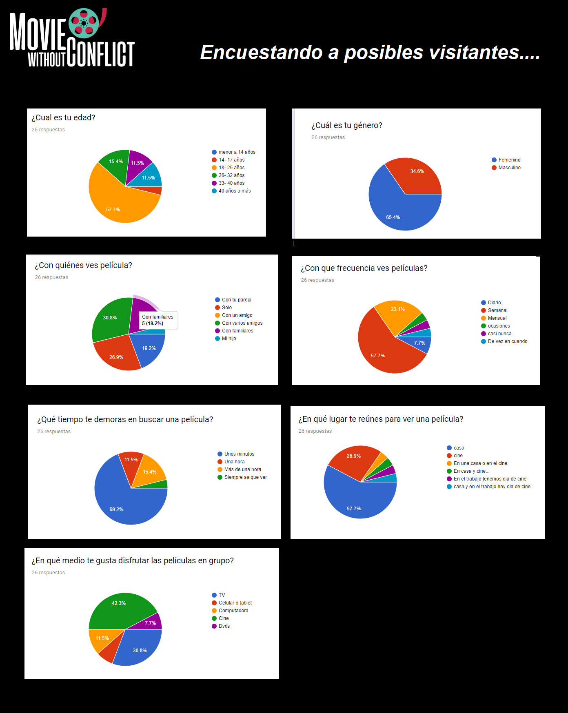
  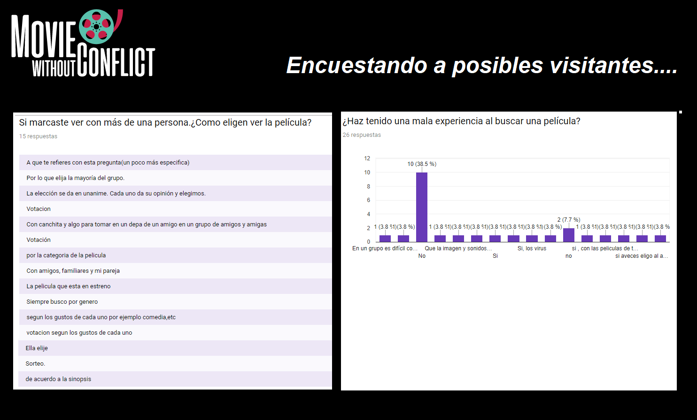

## PROCESO IMPLEMENTACIÓN

### PLANNING
  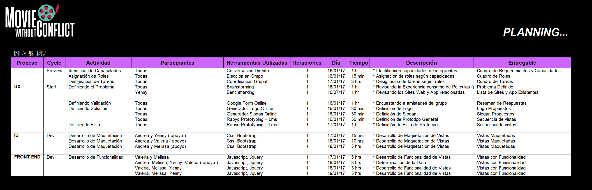
  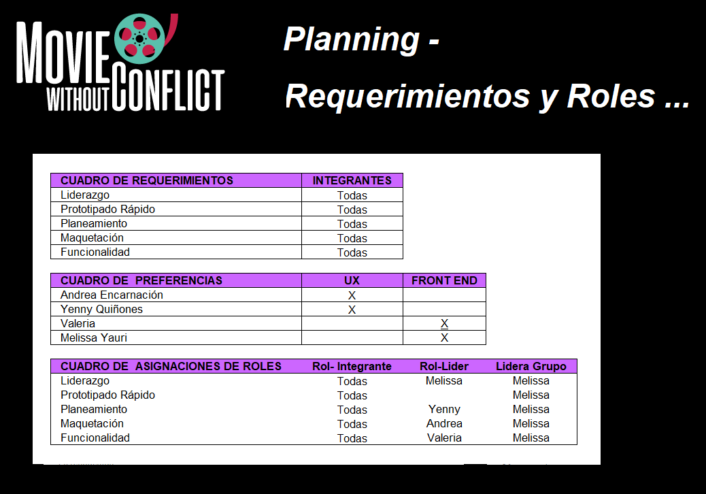
  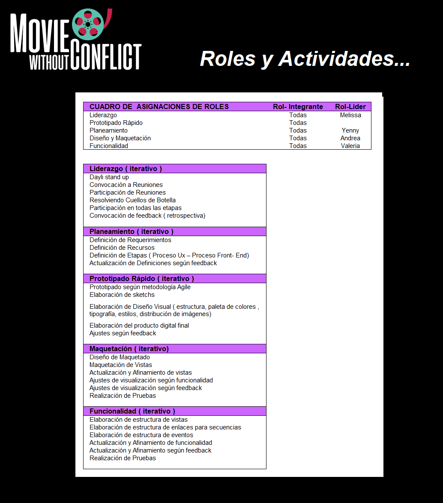

### ETAPA USER EXPERIENCIE - UX
#### EMPATIZANDO - IDENTIFICANDO LA NECESIDAD
Se han identificado la historia real de un electricita, y a través de entrevistas se han identificado sus necesidades.

##### Entrevista:
* Encuesta Online a Posibles Visitantes: Se encuestó a 26 personas.
* Entrevista Presencial a amistades .

##### Primeras Conclusiones:
- Falta de punto de contacto entre personas que en grupo 
quieren ver una película y no quieren tener el conflicto
a la hora de elegír una película, debido al tiempo que ello
les implica

- Ausencia de un site y/o aplicativo que permita a cada integrante de grupo a elegir sus preferencias y obtener
las coincidencias de películas posibles a ver , resultando un match! que les evite conflictos de elección.

#### PROFUNDIZANDO - CONOCIENDO MÁS
##### Historias:
#### ¿Quieres ver una película con tu pareja, y no saben cual elegir?
  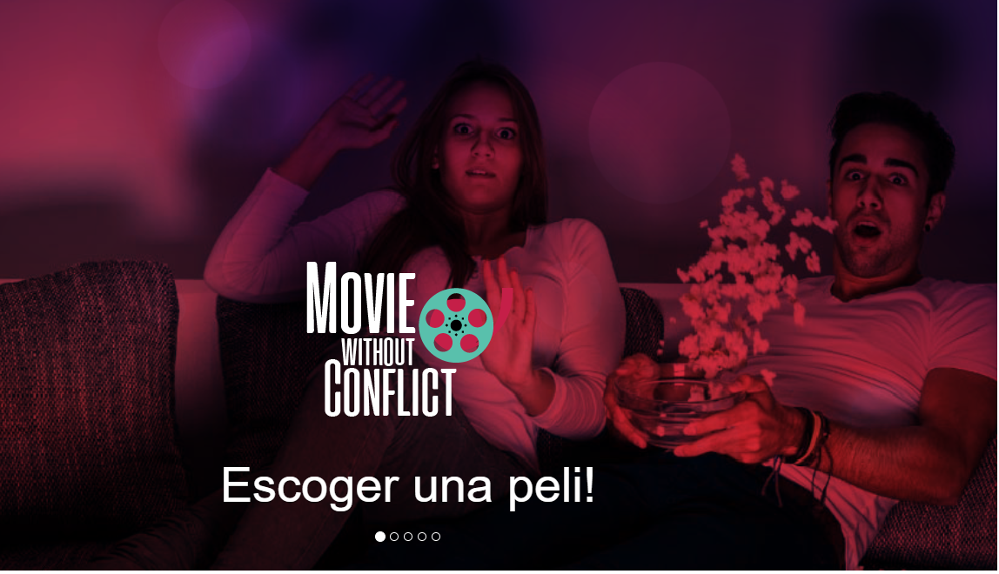
#### ¿Estás con tus amigos, quieren ver una película y no se ponen de acuerdo?
  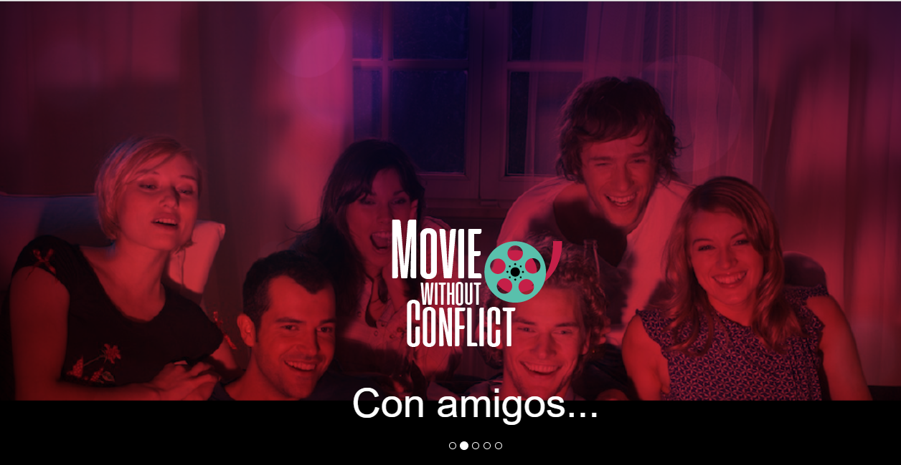
#### ¿Estás solito? y quieres relajarte y no perder mucho tiempo en elegir una pelicula.
  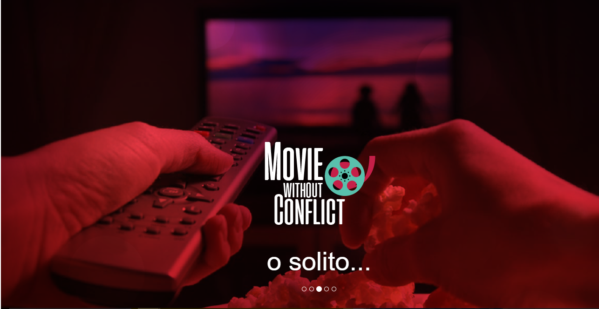
#### Quieres ver una película con tu pareja, y no saben cual elegir?
  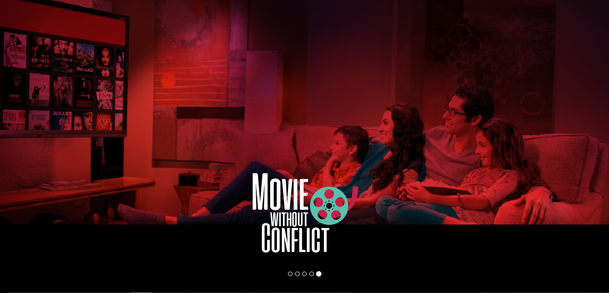

### SKETCH
#### Sketch de Valeria
 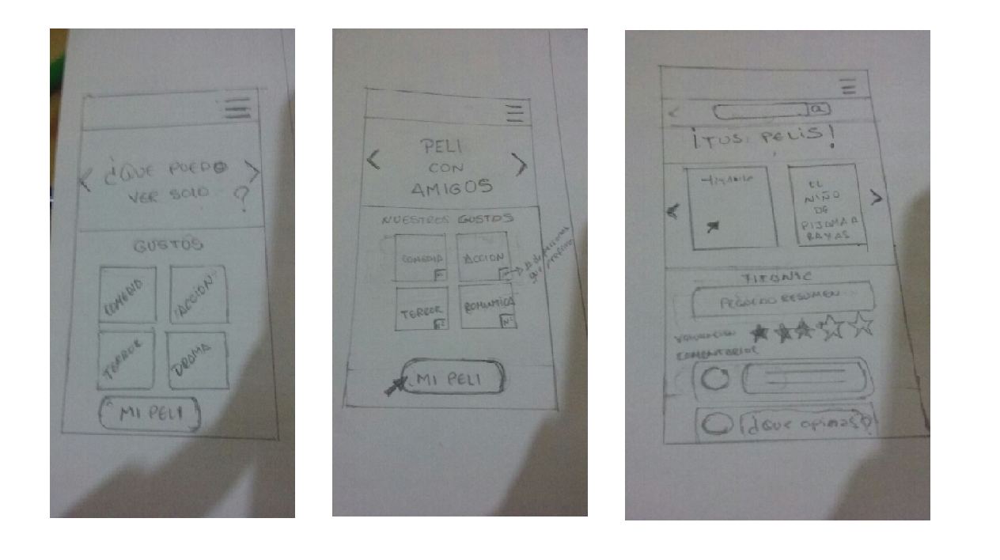
#### Sketch de Yenny
 
#### Sketch de Melissa
 
#### Sketch de Andrea : Prototipo Final
 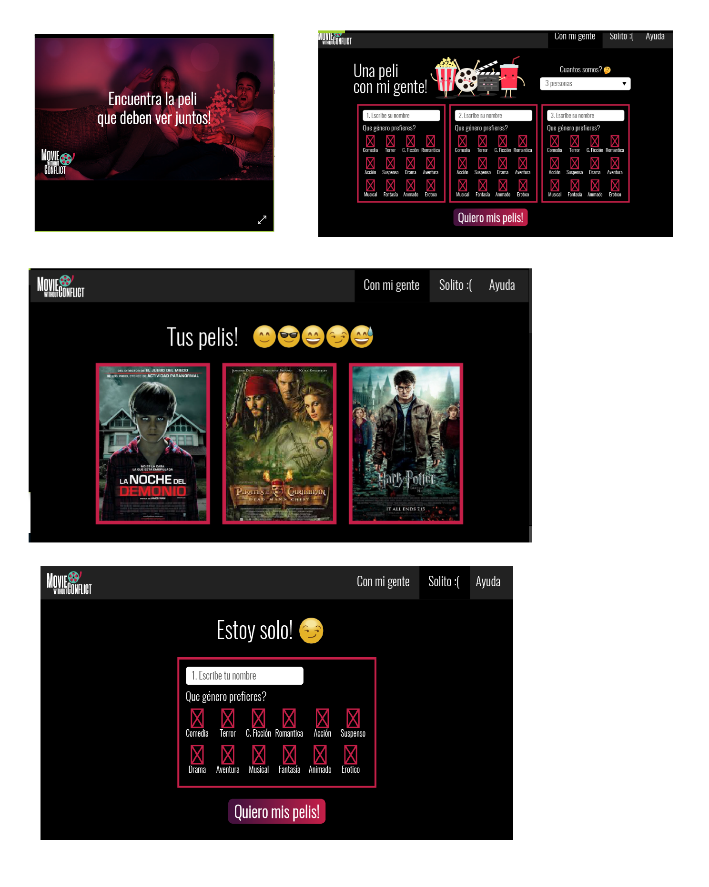

 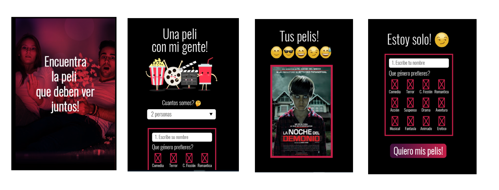

 hola
